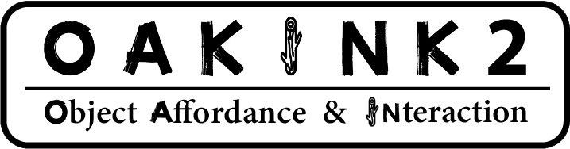
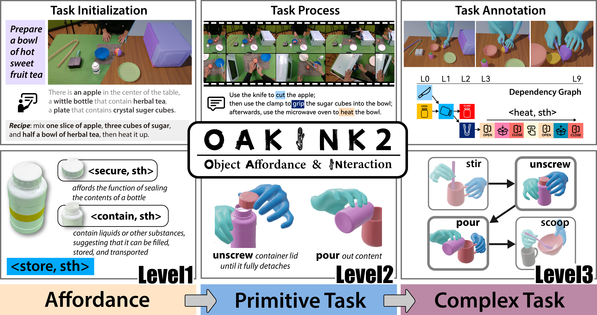

<p align="center">
  <p align="center">
    
  </p>
  <h2 align="center">A Dataset of Bimanual Hands-Object Manipulation in Complex Task Completion
  </h2>
  <h3 align="center">:wrench: Dataset Toolkit</h3>

  <p align="center">
    <a href="https://github.com/kelvin34501"><strong>Xinyu Zhan*</strong></a>
    ·
    <a href="https://lixiny.github.io"><strong>Lixin Yang*</strong></a>
    ·
    <a href=""><strong>Yifei Zhao</strong></a>
    ·
    <a href=""><strong>Kangrui Mao</strong></a>
    ·
    <a href=""><strong>Hanlin Xu</strong></a>
    <br>
    <a href=""><strong>Zenan Lin</strong></a>
    ·
    <a href="https://kailinli.top"><strong>Kailin Li</strong></a>
    ·
    <a href="https://mvig.org"><strong>Cewu Lu</strong>&dagger;</a>
  </p>
  <h3 align="center">CVPR 2024</h3>
    <div align="center">
    
  </div>
  <br/>

  <p align="center">
    <a href="https://arxiv.org/pdf/2403.19417.pdf">
      </a>
    <a href='https://oakink.net/v2'>
      </a>
    <a href="https://www.youtube.com/watch?v=u8fV1TWUvdQ"></a>
  </p>
</p>

This repo contains the OakInk2 dataset toolkit (oakink2_toolkit) -- a Python package that provides data loading, splitting, and visualization.

## Setup dataset files.

    Download tarballs from [huggingface](https://huggingface.co/datasets/kelvin34501/OakInk-v2).
    You will need the data tarball and the preview version annotation tarball for at least one sequence, the object_raw tarball, the object_repair tarball and the program tarball.
    Organize these files as follow:
    ```
    data
    |-- data
    |   `-- scene_0x__y00z++00000000000000000000__YYYY-mm-dd-HH-MM-SS
    |-- anno_preview
    |   `-- scene_0x__y00z++00000000000000000000__YYYY-mm-dd-HH-MM-SS.pkl
    |-- object_raw
    |-- object_repair
    `-- program
    ```

## OakInk2 Toolkit

1. Install the package.

    ```bash
    pip install .
    ```

    Optionally, install it with editable flags:
    ```bash
    pip install -e .
    ```

2. Check the installation.

    ```bash
    python -c 'from oakink2_toolkit.dataset import OakInk2__Dataset'
    ```

    It the command runs without error, the installation is successful.


## OakInk2 Preview-Tool


1. Setup the enviroment.

    1. Create a virtual env of python 3.10. This can be done by either `conda` or python package `venv`.
    
        1. `conda` approach
            
            ```bash
            conda create -p ./.conda python=3.10
            conda activate ./.conda
            ```

        2. `venv` approach
            First use `pyenv` or other tools to install a python intepreter of version 3.10. Here 3.10.14 is used as example:

            ```bash
            pyenv install 3.10.14
            pyenv shell 3.10.14
            ```

            Then create a virtual environment:

            ```bash
            python -m venv .venv --prompt oakink2_preview
            . .venv/bin/activate
            ```
    
    2. Install the dependencies.

        Make sure all bundled dependencies are there.
        ```bash
        git submodule update --init --recursive --progress
        ```

        Use `pip` to install the packages:
        ```bash
        pip install -r req_preview.txt
        ```

2. Download the [SMPL-X model](https://smpl-x.is.tue.mpg.de/download.php)(version v1.1) and place the files at `asset/smplx_v1_1`.
    
    The directory structure should be like:
    ```
    asset
    `-- smplx_v1_1
       `-- models
            |-- SMPLX_NEUTRAL.npz
            `-- SMPLX_NEUTRAL.pkl
    ```

3. Launch the preview tool:
    ```bash
    python -m launch.viz.gui --cfg config/gui__preview.yml
    ```

    Or use the shortcut:
    ```bash
    oakink2_viz_gui --cfg config/gui_preview.yml
    ```

4. (Optional) Preview task in segments.

    1. Download the [MANO model](https://mano.is.tue.mpg.de)(version v1.2) and place the files at `asset/mano_v1_2`.

        The directory structure should be like:
        ```
        asset
        `-- mano_v1_2
            `-- models
                |-- MANO_LEFT.pkl
                `-- MANO_RIGHT.pkl
        ```

    2. Launch the preview segment tool (press enter to proceed). Note `seq_key` should contain '/' rather than '++' as directory separator.

        ```bash
        python -m oakink2_preview.launch.viz.seg_3d --seq_key scene_0x__y00z/00000000000000000000__YYYY-mm-dd-HH-MM-SS
        ```

        Or use the shortcut:
        ```bash
        oakink2_viz_seg3d --seq_key scene_0x__y00z/00000000000000000000__YYYY-mm-dd-HH-MM-SS
        ```

5. (Optional) View the introductory video on [youtube](https://www.youtube.com/watch?v=Xtk07q5HiOg).


## Dataset Format

+ `data/scene_0x__y00z++00000000000000000000__YYYY-mm-dd-HH-MM-SS`

    This stores the captured multi-view image streams. Stream from different cameras are stored in different subdirectories.
    ```
    scene_0x__y00z++00000000000000000000__YYYY-mm-dd-HH-MM-SS
    |-- <serial 0>
    |   |-- <frame id 0>.jpg
    |   |-- <frame id 1>.jpg
    |   |-- ...
    |   `-- <frame id N>.jpg
    |-- ...
    `-- <serial 3>
        |-- <frame id 0>.jpg
        |-- <frame id 1>.jpg
        |-- ...
        `-- <frame id N>.jpg
    ```

+ `anno/scene_0x__y00z++00000000000000000000__YYYY-mm-dd-HH-MM-SS.pkl`

    This pickle stores a dictonary under the following format:
    ```
    {
        'cam_def': dict[str, str],                      # camera serial to name mapping
        'cam_selection': list[str],                     # selected camera names
        'frame_id_list': list[int],                     # image frame id list in current seq 
        'cam_intr': dict[str, dict[int, np.ndarray]],   # camera intrinsic matrix [3, 3]
        'cam_extr': dict[str, dict[int, np.ndarray]],   # camera extrinsic matrix [4, 4]
        'mocap_frame_id_list': list[int],               # mocap frame id list in current seq
        'obj_list': list[str],                          # object part id list in current seq
        'obj_transf': dict[str, dict[int, np.ndarray]], # object transformation matrix [4, 4]
        'raw_smplx': dict[int, dict[str, torch.Tensor]],# raw smplx data
        'raw_mano':  dict[int, dict[str, torch.Tensor]],# raw mano data
    }
    ```
+ `object_{raw,scan}/obj_desc.json`

    This stores the object description in the following format:
    ```
    {
        obj_id: {
            "obj_id": str,
            "obj_name": str,
        }
    }
    ```

+ `object_{raw,scan}/align_ds`

    This directory stores the object models.
    ```
    align_ds
    |-- obj_id
    |   |-- *.obj/ply
    |   |-- ...
    `-- ...
    ```

+ `program/program_info/scene_0x__y00z++00000000000000000000__YYYY-mm-dd-HH-MM-SS.json`

    ```
    {
        (str(lh_interval), str(rh_interval)): {
            "primitive": str,
            "obj_list: list[str],
            "interaction_mode": str,        # [lh_main, rh_main, bh_main]
            "primitive_lh": str,
            "primitive_rh": str,
            "obj_list_lh": list[str],
            "obj_list_rh": list[str],
        }
    }
    ```

    + {lh,rh}_interval: the interval of the primitive in the sequence. If `None`, the corresponding hand is not available (e.g. doing something else) in current primitive.
    + primitive: the primitive id.
    + obj_list: the object list involved in the primitive.
    + interaction_mode: the interaction mode of the primitive. `lh_main` means the left hand is the **main hand for affordance implementation**. Similarly, `rh_main` means the right hand is the main hand, and `bh_main` means both hands are main hands.
    + primitive_{lh,rh}: the primitive id for the left/right hand.
    + obj_list_{lh,rh}: the object list involved in the left/right hand.

+ `program/desc_info/scene_0x__y00z++00000000000000000000__YYYY-mm-dd-HH-MM-SS.json`

    ```
    {
        (str(lh_interval), str(rh_interval)): {
            "seg_desc": str,                # textual description of current primitive
        }
    }
    ```

+ `program/initial_condition_info/scene_0x__y00z++00000000000000000000__YYYY-mm-dd-HH-MM-SS.json`

    ```
    {
        (str(lh_interval), str(rh_interval)): {
            "initial_condition": list[str], # initial condition for the complex task
            "recipe": list[str],            # requirements to complete for the complex task
        }
    }
    ```

+ `program/pdg/scene_0x__y00z++00000000000000000000__YYYY-mm-dd-HH-MM-SS.json`

    ```
    {
        "id_map": dict[interval, int],      # map from interval to primitive id
        "v": list[int],                     # list of vertices
        "e": list[list[int]],               # list of edges
    }
    ```
    <!-- Note that some filtering is required to properly load pdg data. See [oakink2_toolkit/dataset.py#L310-L323](src/oakink2_toolkit/dataset.py) for contracting excessive nodes. -->
